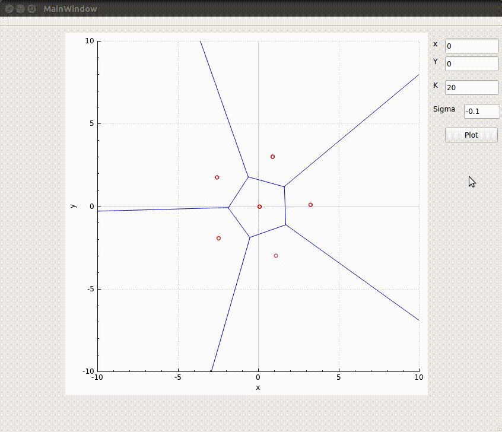

# Coverage control implemented by Voronoi tessellation and Density function



## Equipment

CPU: i5-3230m

RAM: 8G

## Build Environments

Ubuntu : 16.04

GCC : 5.4.0

Qt  : greater than 5.7

Qt creator : 4.4

## Prerequisite Library

CPP11/STL

CGAL : [4.11](https://www.cgal.org/)

`sudo apt-get install libcgal-dev`

qcustomplot : [2.0.0](http://www.qcustomplot.com/index.php/download)

Voronoi tessellation Algorithm  voronoi.h/.cpp (pure C++ 11)

## Block Diagram:


## Voronoi Tessellation:


## Reference
CENTROIDAL VORONOI TESSELLATIONS ([CVT](https://www.whitman.edu/Documents/Academics/Mathematics/burns.pdf))
[Distributed  Dynamic  Density  Coverage  for  Human-Swarm Interactions](https://magnus.ece.gatech.edu/Papers/denseACC15.pdf)


## Trouble Shooting:

If you get error as following , try to comment the assertion `CGAL_kernel_assertion ( ! CGAL_NTS is_zero(den) );
` which is in path :`/usr/include/CGAL/constructions/kernel_ftC2.h`

```
terminate called after throwing an instance of 'CGAL::Assertion_exception'
what():  CGAL ERROR: assertion violation!
Expr: ! CGAL_NTS is_zero(den)
File: /usr/include/CGAL/constructions/kernel_ftC2.h
Line: 62
The program has unexpectedly finished.
```

